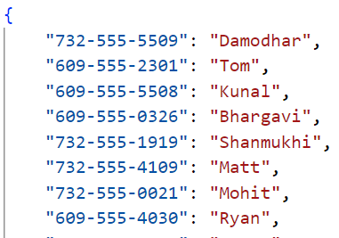
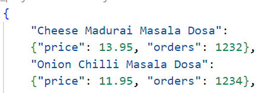

## Midterm Project

The python script midterm_project.py reads the JSON file , process it and creates two JSON files. 
1. items.json - contains the all items ordered and their price and number of orders places.
2. customers.json - contains the all customers names and phone numbers.

#### Requirements
python : 3.x
JSON file

### Working
The script has the following functions
**read_json(file_path)**: read the input JSON file 
**get_customers_json(json_data, output_file)** : parses the JSON data and saves the customer information in the output file. 
**get_items_json(json_data, output_file)**: parses the input json data and saves the items information in the output file. 

Sample Input:
  {
        "timestamp": 1704037076,
        "name": "Durga",
        "phone": "609-555-1102",
        "items": [
            {
                "name": "Cheese Mysore Masala Dosa",
                "price": 13.95
            },
            {
                "name": "Gun Powder Dosa",
                "price": 13.95
            },
            {
                "name": "Malgudi Onion Rava Masala Dosa",
                "price": 14.95
            }
        ],
        "notes": ""
    }

### Output
customers.json

items.json

